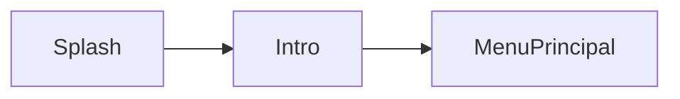
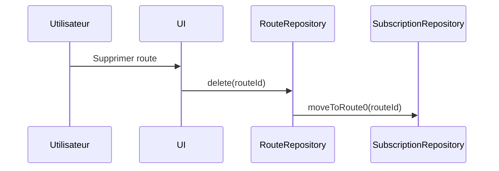
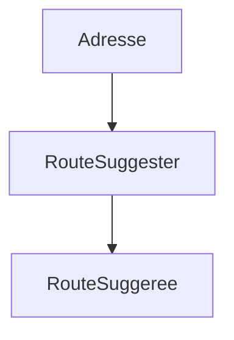
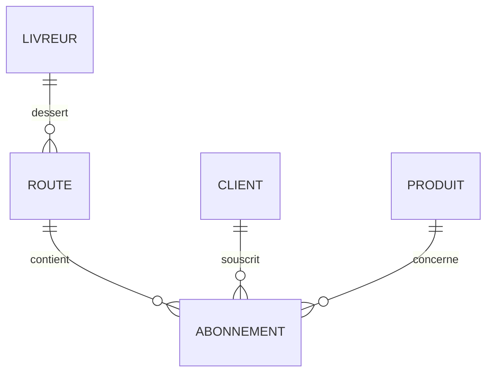
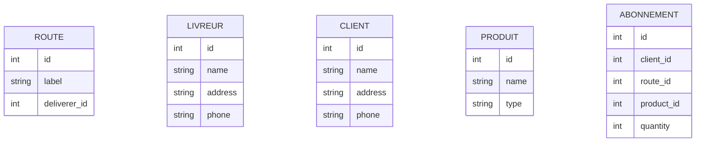
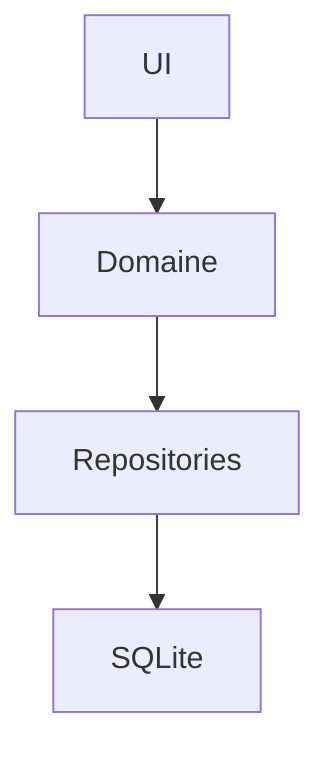
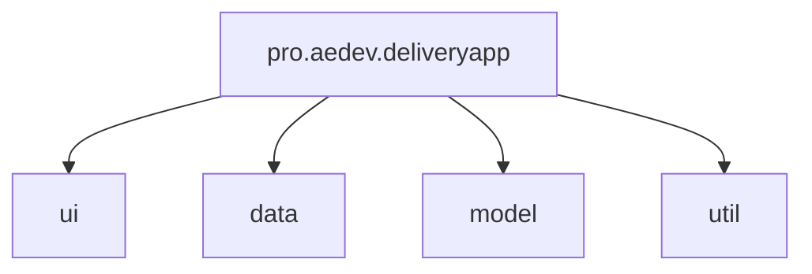
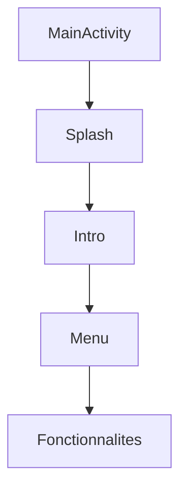
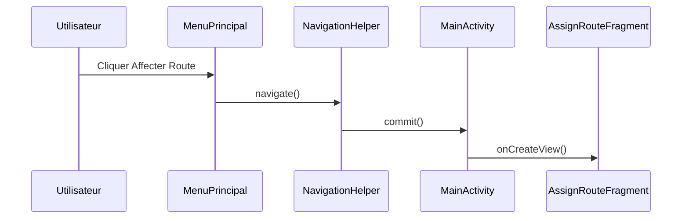
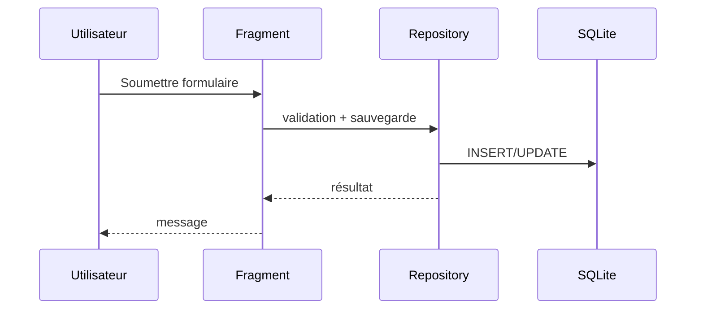

# Magazine Delivery App – Documentation technique complète

## 1. Introduction

Ce document constitue la **documentation technique complète** de l’application **Magazine Delivery App**, une application Android développée en Java utilisant SQLite et une architecture à activité unique basée sur des fragments.

L’objectif de cette documentation est de démontrer, de manière formelle et structurée, que **l’ensemble des exigences fonctionnelles, techniques, architecturales et ergonomiques du mandat sont intégralement respectées**. Elle expose également les choix de conception, la structure interne du projet, les flux de navigation, le modèle de données et les mécanismes de persistance.

Le document est rédigé dans un style académique et professionnel, adapté à une remise officielle dans un contexte d’évaluation.

------

## 2. Présentation générale du projet

### 2.1 Objectif de l’application

L’application permet à une entreprise de livraison de magazines et de journaux de :

- Gérer les **routes de livraison**
- Gérer les **livreurs**
- Gérer les **clients (abonnés)**
- Gérer les **abonnements** (adresses, produits, quantités)
- Associer et dissocier des routes aux livreurs
- Produire différentes **listes opérationnelles** (par route, par livreur, par produit, par abonné)

L’application fonctionne entièrement en **mode local**, sans dépendance réseau, à l’aide d’une base de données SQLite.

### 2.2 Plateforme et contraintes techniques

| Élément      | Valeur                      |
| ------------ | --------------------------- |
| Plateforme   | Android                     |
| Langage      | Java                        |
| Interface    | XML + ViewBinding           |
| Architecture | Activité unique + Fragments |
| Persistance  | SQLite (sans Room)          |
| Pattern      | Architecture en couches     |
| Localisation | Anglais + Français canadien |

------

## 3. Couverture des exigences fonctionnelles

Cette section démontre la conformité de l’implémentation avec le mandat fourni.

### 3.1 Démarrage de l’application

**Exigences respectées :**

- Chargement des données depuis SQLite au démarrage
- Affichage d’un écran de chargement (splash screen)
- Affichage d’un écran de présentation
- Navigation par geste de balayage (swipe)

**Implémentation :**

- `SplashFragment` affiche le logo et initialise l’application
- `IntroFragment` affiche la présentation et intercepte le swipe vers la gauche
- La navigation est centralisée via `NavigationHelper`

------

### 3.2 Menu principal

Le menu principal offre toutes les fonctionnalités requises :

- Ajouter / Supprimer une route
- Affecter une route
- Ajouter / Retirer un abonnement
- Ajouter / Retirer un livreur
- Lister
- Quitter

Le bouton **Ajouter un livreur** est automatiquement désactivé lorsque toutes les routes ont déjà un livreur assigné.

------

### 3.3 Gestion des routes

#### Ajout d’une route

- Création automatique d’une route avec identifiant unique
- Message de confirmation affichant le numéro de route

#### Suppression d’une route

- Validation de l’existence de la route
- Interdiction de suppression invalide
- Réaffectation automatique des abonnements vers la **route 0** (sans route)

------

### 3.4 Affectation des routes

**Règles métier appliquées :**

- Une route possède au plus **un livreur**
- Un livreur peut être associé à **plusieurs routes**

Fonctionnalités :

- Affecter un livreur à une route
- Retirer un livreur d’une route

Des messages de succès ou d’erreur sont affichés selon la validité des données.

------

### 3.5 Gestion des abonnements

#### Ajout d’un abonnement

- Écran divisé (1/3 actions, 2/3 formulaire)
- Champs :
  - Client
  - Adresse
  - Produit
  - Quantité
  - Route suggérée (modifiable)

La suggestion de route est gérée par une classe utilitaire dédiée.

#### Suppression d’un abonnement

- Recherche par identifiant
- Affichage des détails
- Mise à jour automatique des routes après suppression

------

### 3.6 Gestion des livreurs

#### Ajout d’un livreur

- Même structure que l’ajout d’abonnement
- Champs : nom, adresse, téléphone

#### Retrait d’un livreur

- Retrait du livreur de toutes ses routes
- Les routes demeurent valides mais non assignées

------

### 3.7 Fonctionnalité de listes

L’écran **Lister** est divisé en deux parties :

- Menu latéral gauche
- Zone de contenu dynamique à droite

#### Listes disponibles

| Type     | Composant               |
| -------- | ----------------------- |
| Livreurs | RecyclerView + GridView |
| Abonnés  | GridView                |
| Routes   | RecyclerView + GridView |
| Produits | RecyclerView + GridView |

La **route 0** regroupe tous les abonnements non assignés.

------

## 4. Modèle de données

### 4.1 Entités

- **Route** : id, label, deliverer_id
- **Livreur** : id, nom, adresse, téléphone
- **Client** : id, nom, adresse, téléphone
- **Produit** : id, nom, type
- **Abonnement** : id, client_id, route_id, produit_id, quantité, dates

### 4.2 Relations

------

## 5. Schéma SQLite

SQLite est géré manuellement via `AppDatabaseHelper` et `AppDatabase`. Chaque dépôt (repository) encapsule les requêtes SQL.

------

## 6. Architecture de l’application

### 6.1 Architecture en couches

### 6.2 Responsabilités

- **UI** : Fragments, Adapters, ViewBinding
- **Domaine** : Modèles Java simples
- **Accès aux données** : Repositories
- **Persistance** : SQLiteOpenHelper

------

## 6.3 Diagramme des packages

------

## 7. Navigation

### 7.1 Flux général

### 7.2 Exemple de transaction de fragment (Affecter route)

------

## 8. Localisation

- Identifiants techniques en anglais
- Textes UI externalisés
- Ressources :
  - `values/strings.xml`
  - `values-fr-rCA/strings.xml`

------

## 9. Conformité UX et UI

- Bouton retour vers le menu principal sur chaque écran
- RecyclerView utilisé par défaut
- GridView uniquement lorsque requis
- Validation utilisateur explicite

------

## 10. Conclusion

L’application **Magazine Delivery App** respecte intégralement les exigences du mandat. Elle démontre :

- Une architecture claire et maintenable
- Une séparation stricte des responsabilités
- Une utilisation correcte des fragments Android
- Une gestion robuste des règles métier
- Une persistance fiable via SQLite

---

## Execution Screenshots:

---

