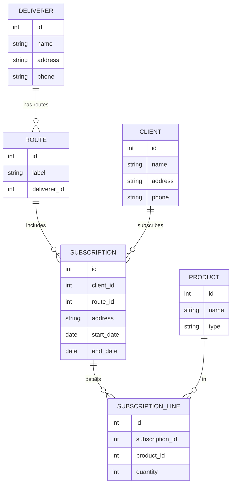
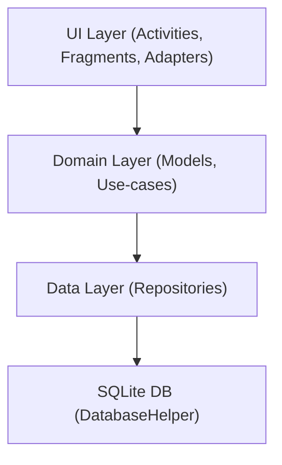
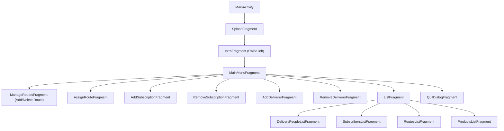
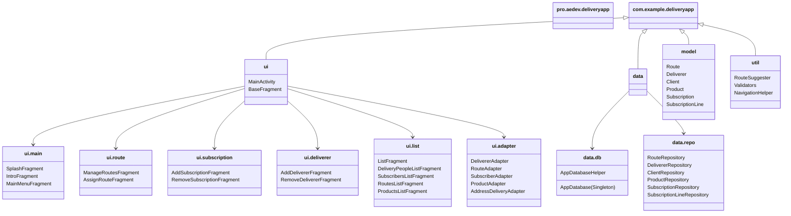

# Magazine Delivery App – Architecture & Design Plan

## 1. Scope and Constraints

- Platform: Android
- Language: Java + XML layouts
- UI structure: Single-activity architecture, multiple fragments
- Navigation: Swiping for first screens, buttons/menu for the rest
- Data persistence: SQLite (manual helper + repositories, no Room)
- Pattern: Simple layered architecture
  - UI layer (activities, fragments, adapters)
  - Domain/data model layer (POJOs)
  - Data access layer (SQLite + repositories)
- UI helpers: ViewBinding enabled
- Localization:
  - Default resources in English
  - French Canadian resources: `values-fr-rCA/strings.xml`
- Optional extra (if time): GPS-based route suggestion and location-aware features

------

## 2. Core Functional Requirements (Extracted)

1. **Startup flow**
   - Load data from SQLite on app start.
   - Show **splash/loading screen** with logo centered.
   - Then show a **brief intro screen** describing the app with a message: swipe left to continue.
   - Swipe left to reach the **general menu screen**.
2. **General menu options**
   - Add / Delete a route
   - Assign route (delivery person ↔ route)
   - Add subscription
   - Remove subscription
   - Add delivery person (disabled if all routes already have a delivery person)
   - List (various lists)
   - Quit (save to DB and exit; DB saving happens continuously, but this is the explicit exit)
3. **Add / Delete route screen**
   - One fragment with two vertical zones:
     - Top: button “Add route” → adds a new route and shows confirmation with created route number.
     - Bottom: input for route number + “Delete route” button.
       - If route ID valid (exists and not 0): delete and show confirmation.
       - If invalid: show error message.
     - When deleting a route:
       - Any subscriptions on that route are moved to **route 0** ("no route").
4. **Assign route screen**
   - Center area:
     - Text field: delivery person name
     - Text field: route number
   - Buttons below: **Assign** and **Remove** assignment.
   - Messages below buttons: success or error.
   - Business rules:
     - Assign: link a delivery person to a route (1 route → 0 or 1 delivery person; 1 delivery person can have multiple routes).
     - Remove: unassign delivery person from a route (route becomes unassigned).
5. **Add subscription screen**
   - Screen split vertically:
     - Left pane (1/3 width): buttons for **Save subscription** and **Back to menu**.
     - Right pane (2/3 width): subscription input:
       - Client name
       - Address
       - Product type(s): magazine and/or newspaper (allow multiple products)
       - Quantity per product type
       - Suggested route number field at bottom center
         - System suggests route number based on address (simple heuristic for now, e.g., last digit or prefix match).
         - User can override the suggested route number.
6. **Remove subscription screen**
   - Screen split vertically:
     - Left pane: buttons **Delete subscription**, **Back to menu**.
     - Right pane:
       - Input: subscription ID
       - Button: **Show** to display subscription details to be deleted.
         - Below: show subscription details when found.
       - When deleting, remove subscription and automatically update route data (the route loses that address/subscription).
7. **Add delivery person screen**
   - Same split layout as Add subscription:
     - Left: **Save**, **Back**.
     - Right: input fields:
       - Name
       - Address
       - Phone number
   - Menu option is disabled when all routes already have a delivery person.
8. **Remove delivery person screen**
   - Center input: delivery person ID
   - Button: **Remove delivery person from route**
   - If valid ID: show success message and unassign this person from all routes.
   - If invalid: show error message.
9. **List screen**
   - Screen split vertically:
     - Left pane: buttons
       - Delivery people
       - Subscribers
       - Routes
       - Products
       - Quit (return to main menu or exit depending on navigation flow)
     - Right pane: content area that changes based on selected button.
   - Delivery people view:
     - RecyclerView listing all delivery people.
     - Clicking an item shows in a GridView:
       - All addresses on that delivery person’s routes
       - For each address: products and quantities, subscriber name.
   - Subscribers view:
     - GridView showing all subscribers with subscription details:
       - Address
       - Products and quantities for each subscription.
   - Routes view:
     - RecyclerView listing all routes.
       - For each route: route number and delivery person name (or "no delivery person").
       - Route `0` is special:
         - Display "no route" as the delivery person label.
         - Contains all subscriptions not assigned to a valid route.
     - Clicking a route shows in a GridView:
       - All addresses on that route
       - Products per address
       - Subscriber name per address.
   - Products view:
     - RecyclerView of all products (magazines/newspapers).
     - Clicking a product shows in a GridView:
       - All delivery addresses for that product
       - Subscriber name
       - Delivery person name
       - Route number.
10. **Quit option**
    - Saves all current data to SQLite (if not already persisted) and returns to system home / closes activity.
11. **General behavior**
    - Every screen has a "Back to menu" button.
    - Use fragments heavily; keep activities minimal.
    - Use RecyclerView for lists except when GridView is explicitly required.

------

## 3. Data Model (Entities and Relationships)

### 3.1 Entities

- **Route**
  - `id` (int, primary key)
  - `name` or `label` (string, optional, may just show "Route #id")
  - `deliverer_id` (int, nullable FK → Deliverer)
  - Special route: `id = 0` = "no route".
- **Deliverer**
  - `id` (int, primary key)
  - `name` (string)
  - `address` (string)
  - `phone` (string)
- **Client (Subscriber)**
  - `id` (int, primary key)
  - `name` (string)
  - `address` (string)
  - `phone` (string, optional)
- **Product**
  - `id` (int, primary key)
  - `name` (string)
  - `type` (enum/string: `MAGAZINE`, `NEWSPAPER`)
- **Subscription**
  - `id` (int, primary key)
  - `client_id` (FK → Client)
  - `route_id` (FK → Route, default 0)
  - `address` (string; can be a copy of client address, but kept here to allow per-subscription override)
  - `start_date` (date, optional)
  - `end_date` (date, optional, nullable)
- **SubscriptionLine**
  - `id` (int, primary key)
  - `subscription_id` (FK → Subscription)
  - `product_id` (FK → Product)
  - `quantity` (int)

### 3.2 ER Diagram (Mermaid)

------

## 4. Application Architecture

### 4.1 Layered Architecture Overview

- **UI Layer**
  - `MainActivity` (single activity)
  - Fragments for each screen
  - Adapters for RecyclerView/GridView
- **Domain Layer**
  - Plain Java model classes representing entities (Route, Deliverer, Client, Product, Subscription, SubscriptionLine).
  - Simple utility classes (e.g., route suggestion, validators).
- **Data Layer**
  - `AppDatabaseHelper` (extends `SQLiteOpenHelper`).
  - Repositories (RouteRepository, DelivererRepository, ClientRepository, ProductRepository, SubscriptionRepository).
  - Each repository exposes CRUD methods returning model objects.

------

## 5. Navigation Structure (Fragments & Flow)

### 5.1 Fragment Map

### 5.2 Screens Layout Summary

- **SplashFragment**
  - Fullscreen logo, minimal logic, short delay then navigate to Intro.
- **IntroFragment**
  - Centered app description.
  - Text at bottom: swipe left to continue.
  - Gesture detector to navigate to MainMenuFragment.
- **MainMenuFragment**
  - Vertical list of buttons for each main feature.
  - "Add Deliverer" button disabled depending on data (when all routes have a deliverer).
- **Functional fragments**
  - Each main function (manage routes, assign route, add subscription, etc.) is a fragment.
  - Each contains internal layout matching exam specifications (panels, lists).
  - Each has a "Back to menu" button.
- **ListFragment**
  - Split layout: left menu (sub-list buttons), right content area.
  - Right area replaced dynamically with child fragments for each list type.

------

## 6. Package Structure (Java)

------

## 7. SQLite Schema (High Level)

- `routes`
  - `id` INTEGER PRIMARY KEY
  - `label` TEXT
  - `deliverer_id` INTEGER NULL
- `deliverers`
  - `id` INTEGER PRIMARY KEY
  - `name` TEXT NOT NULL
  - `address` TEXT NOT NULL
  - `phone` TEXT
- `clients`
  - `id` INTEGER PRIMARY KEY
  - `name` TEXT NOT NULL
  - `address` TEXT NOT NULL
  - `phone` TEXT
- `products`
  - `id` INTEGER PRIMARY KEY
  - `name` TEXT NOT NULL
  - `type` TEXT NOT NULL
- `subscriptions`
  - `id` INTEGER PRIMARY KEY
  - `client_id` INTEGER NOT NULL
  - `route_id` INTEGER NOT NULL DEFAULT 0
  - `address` TEXT NOT NULL
  - `start_date` TEXT
  - `end_date` TEXT
- `subscription_lines`
  - `id` INTEGER PRIMARY KEY
  - `subscription_id` INTEGER NOT NULL
  - `product_id` INTEGER NOT NULL
  - `quantity` INTEGER NOT NULL
- Possible helpers
  - Views or queries to join `subscriptions` + `clients` + `routes` + `deliverers` + `products` for listing screens.

------

## 8. Localization Plan

- Use English identifiers in code and database.
- Resource files:
  - `res/values/strings.xml` → English
  - `res/values-fr-rCA/strings.xml` → French Canadian
- All UI text (labels, hints, messages, errors) goes in string resources only.
- Keep field labels and messages aligned with exam wording in French, but class/variable names in English.

------

## 9. Optional GPS Integration (If Time Allows)

- Add location permission and use `FusedLocationProviderClient` to get current device location.
- Use GPS mainly to improve **route suggestion** for a new subscription:
  - Approximate location cluster to map addresses to closest route.
- This must be strictly optional so that the core app (without permissions) still fully passes course requirements.

------

# Project source prompt:

# Mandat

Une entreprise de livraison de magazines et journaux mandate le développement d'une application pour gérer les livraisons. L'application doit permettre l'enregistrement et la sauvegarde des clients, des livreurs, ainsi que d'autres données liées aux opérations. Le système doit aussi produire diverses listes utiles. Par exemple, pour chaque livreur, le système doit lister toutes les adresses faisant partie de sa route. De plus, il doit être possible de lister tous les clients abonnés à un produit donné. L'application doit permettre d'ajouter ou de retirer une adresse d'une route. Une route représente l'ensemble des adresses composant le circuit quotidien d'un livreur.

# Fonctionnement de l'application

Au démarrage, si des données existent en base de données, elles sont chargées. Un écran de chargement avec logo s'affiche brièvement, puis laisse place à un écran de présentation. Ce premier écran indique à l'utilisateur qu'il doit swiper vers la gauche pour accéder au menu principal.

Le menu principal contient les options suivantes :

- Ajouter / Supprimer une route
- Affecter Route
- Ajouter un abonnement
- Retirer un abonnement
- Ajouter un livreur (désactivé si toutes les routes ont déjà un livreur)
- Lister
- Quitter

## Ajouter ou supprimer une route

Un écran séparé en deux :

- **Partie supérieure** : un bouton "Ajouter une route". Au clic, un message apparaît confirmant la création de la route et affichant son numéro.

- **Partie inférieure** : un champ permettant d'entrer un numéro de route et un bouton "Supprimer la route". Au clic, si le numéro est valide, un message confirme la suppression; sinon, un message d'erreur apparaît.

  # done 2025-12-07

  ---

  

## Affecter Route

Un écran contenant :

- champ pour entrer le nom du livreur
- champ pour entrer le numéro de route
- boutons "Affecter" et "Retirer"

Des messages de confirmation ou d'erreur s'affichent selon la validité des données.

# done 2025-12-07

---

## Ajouter un abonnement

Écran divisé verticalement :

- **Partie gauche (1/3 largeur)** : bouton pour enregistrer l'abonnement, bouton pour retourner au menu.
- **Partie droite (2/3)** : champs pour nom du client, adresse, type(s) de produit(s), quantités. Un champ en bas suggère un numéro de route basé sur l'adresse; il peut être modifié.

## Retirer un abonnement

Écran similaire à l'ajout :

- **Partie gauche** : boutons pour supprimer l'abonnement et revenir au menu.
- **Partie droite** : champ pour entrer un numéro d'abonnement et bouton "Afficher". La suppression met automatiquement à jour la route concernée.

## Ajouter un livreur

Même format que l'ajout d'abonnement, mais les champs concernent : nom, adresse, numéro de téléphone du livreur.

# done 2025-12-07

---

## Retirer un livreur

Un écran simple avec :

- champ pour entrer un numéro de livreur
- bouton "Supprimer le livreur de la route"

Messages de confirmation ou d'erreur selon la validité du numéro.

# done 2025-12-07

---

## Lister

Écran séparé en deux :

- **Partie gauche** : boutons Livreurs, Abonnés, Routes, Produits, Quitter
- **Partie droite** : contenu dépendant de la sélection

### Liste des livreurs

RecyclerView listant les livreurs. Un clic affiche dans un GridView les adresses de la route avec :

- nom et quantité des produits livrés
- nom de l'abonné

### Liste des abonnés

GridView listant :

- adresse
- produits et quantités associés

### Liste des routes

Liste affichant : numéro de route, nom du livreur (ou "pas de livreur").
 Un clic affiche un GridView avec les adresses de la route et la livraison associée.

La route 0 regroupe les abonnements n'ayant pas été réaffectés après suppression d'une route.

### Liste des produits

RecyclerView listant les produits. Un clic affiche un GridView listant :

- adresses de livraison
- nom de l'abonné
- nom du livreur

## Quitter

Enregistre les données dans la base et ferme l'application.

# Notes

- Chaque écran doit avoir un bouton pour revenir au menu principal.
- L'utilisation de fragments est fortement recommandée.
- Si un mode d'affichage n'est pas spécifié comme GridView, utiliser un RecyclerView en liste simple.