# Magazine Delivery App – Technical Documentation

## 1. Introduction

This document provides a complete technical documentation for the **Magazine Delivery App**, an Android application developed in Java using SQLite and a fragment‑based single‑activity architecture. The purpose of this document is to formally demonstrate that **all functional, technical, architectural, and UI/UX requirements defined in the mandate are fully respected**, and to expose the internal design choices, data model, navigation flow, and implementation structure.

The documentation is written in a formal and academic tone, aligned with evaluation criteria for Android development courses. English is used for technical clarity; some domain terms remain in English by convention in the programming ecosystem.

------

## 2. Project Overview

### 2.1 Objective

The application allows a magazine and newspaper delivery company to:

- Manage **routes**, **delivery personnel**, **clients**, **subscriptions**, and **products**
- Assign and unassign routes to delivery personnel
- Associate subscriptions (addresses + products) to routes
- Produce multiple **operational lists** (by route, by product, by deliverer, by subscriber)

The system is designed to be **offline‑first**, relying entirely on a local SQLite database.

### 2.2 Platform & Constraints

| Aspect       | Value                               |
| ------------ | ----------------------------------- |
| Platform     | Android                             |
| Language     | Java                                |
| UI           | XML layouts + ViewBinding           |
| Architecture | Single Activity, multiple Fragments |
| Persistence  | SQLite (manual helper, no Room)     |
| Pattern      | Layered architecture                |
| Localization | English + French (fr‑CA)            |

------

## 3. Functional Requirements Coverage

This section maps each mandate requirement to its concrete implementation.

### 3.1 Application Startup Flow

**Requirements respected:**

- Load data from SQLite on startup
- Display a splash screen
- Display an introduction screen with swipe gesture
- Navigate to main menu

**Implementation:**

- `SplashFragment` displays the centered logo and performs initial loading
- `IntroFragment` presents the app description and handles **left swipe gesture**
- Navigation is handled by `NavigationHelper`

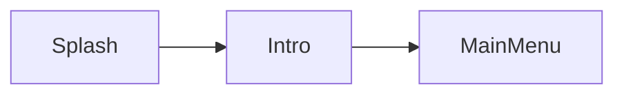

------

### 3.2 Main Menu

The main menu exposes all required actions:

- Add / Remove Route
- Assign Route
- Add / Remove Subscription
- Add / Remove Deliverer
- List
- Quit

The **Add Deliverer** option is dynamically disabled when all routes already have an assigned deliverer.

------

### 3.3 Route Management

#### Add Route

- Creates a new route with an auto‑generated ID
- Displays confirmation with route number

#### Delete Route

- Validates route existence
- Prevents deletion of invalid routes
- Automatically moves associated subscriptions to **route 0** ("no route")

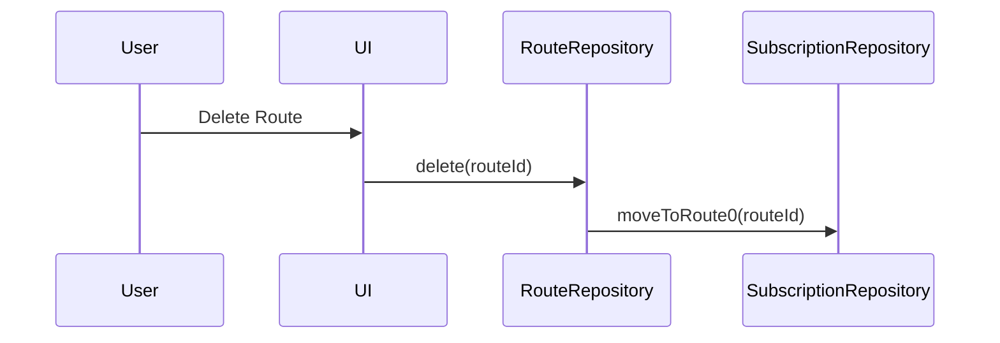

------

### 3.4 Route Assignment

**Rules enforced:**

- A route can have **0 or 1 deliverer**
- A deliverer can manage **multiple routes**

Supported actions:

- Assign deliverer to route
- Remove deliverer from route

Errors and confirmations are displayed inline.

------

### 3.5 Subscription Management

#### Add Subscription

- Split screen layout (1/3 actions, 2/3 form)
- Fields:
  - Client
  - Address
  - Product
  - Quantity
  - Route (suggested, overridable)

Route suggestion is handled by a dedicated utility class.

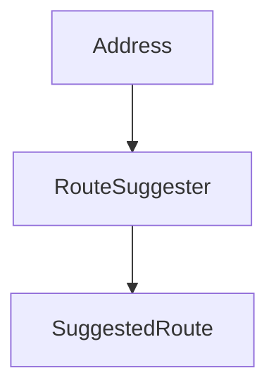

#### Remove Subscription

- Lookup by subscription ID
- Display full subscription details
- On deletion, route data is automatically updated

------

### 3.6 Deliverer Management

#### Add Deliverer

- Same split layout as subscription screen
- Fields: name, address, phone

#### Remove Deliverer

- Removes deliverer from all assigned routes
- Routes remain valid but unassigned

------

### 3.7 Listing Features

The **List** screen is split into:

- Left menu: list selectors
- Right content: dynamic fragment replacement

#### Supported Lists

| Category    | View Type               |
| ----------- | ----------------------- |
| Deliverers  | RecyclerView + GridView |
| Subscribers | GridView                |
| Routes      | RecyclerView + GridView |
| Products    | RecyclerView + GridView |

Special handling:

- **Route 0** aggregates all unassigned subscriptions

------

## 4. Data Model

### 4.1 Entities

#### Route

- id
- label
- deliverer_id (nullable)

Special case: `id = 0` represents unassigned subscriptions.

#### Deliverer

- id
- name
- address
- phone

#### Client

- id
- name
- address
- phone

#### Product

- id
- name
- type (MAGAZINE / NEWSPAPER)

#### Subscription

- id
- client_id
- route_id
- address
- product_id
- quantity
- start_date
- end_date

------

### 4.2 Entity Relationships

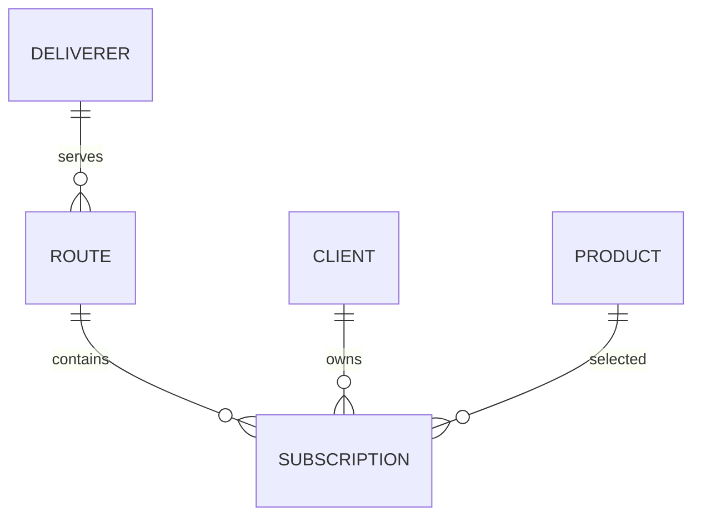

------

## 5. SQLite Schema

SQLite is implemented using a manual `SQLiteOpenHelper` (`AppDatabaseHelper`) and an access façade (`AppDatabase`). Repositories execute CRUD operations using SQL statements and map results to POJOs.

### 5.1 Schema Overview

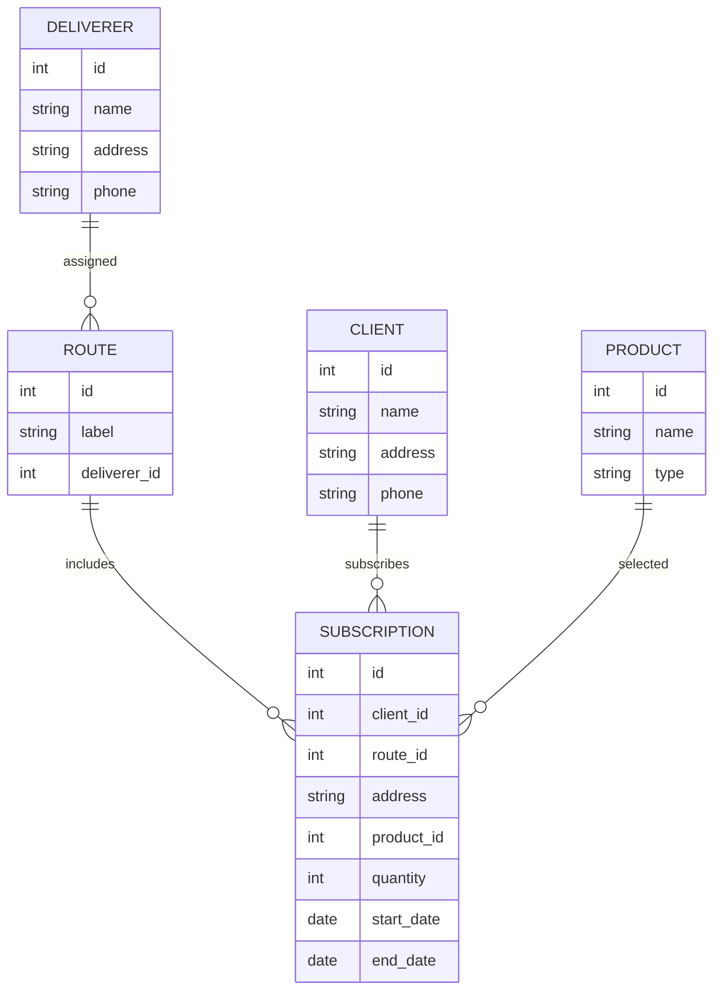

### 5.2 Persistence Lifecycle

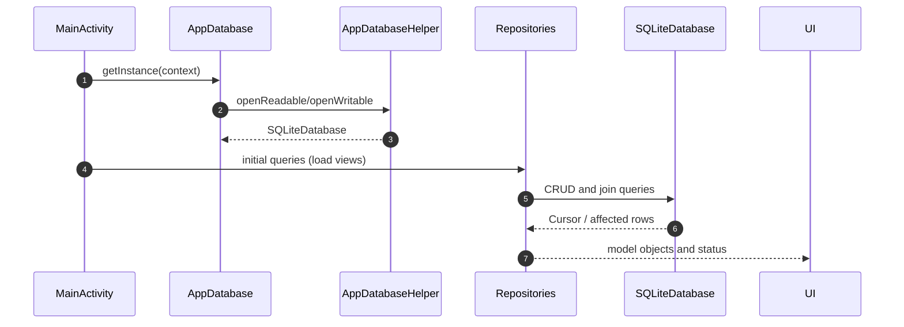

------

## 6. Application Architecture

### 6.1 Layered Architecture

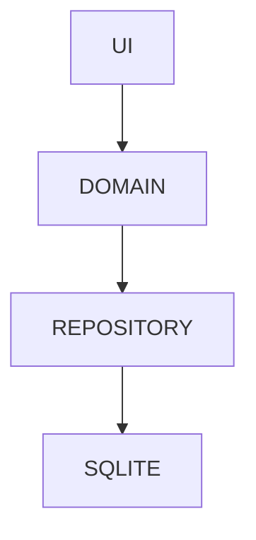

### 6.2 Responsibilities

- **UI Layer**: Fragments, Adapters, ViewBinding
- **Domain Layer**: Plain Java models
- **Repository Layer**: CRUD operations, joins
- **Database Layer**: SQLiteOpenHelper

------

## 6.3 Package Structure Diagram

The following diagram reflects the **actual Java source tree** (packages and sub-packages) as implemented in the project. It emphasizes responsibility boundaries and typical dependency direction.

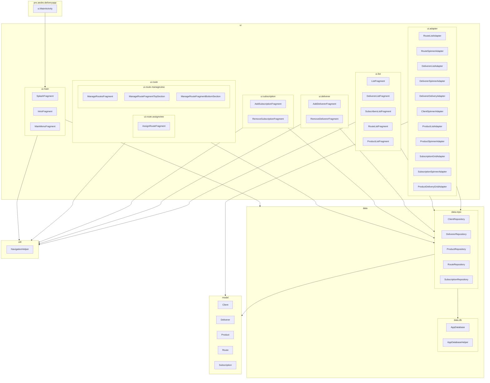

------

## 6.4 Class Responsibility Diagram

This diagram summarizes the primary responsibilities and how core classes collaborate at runtime.

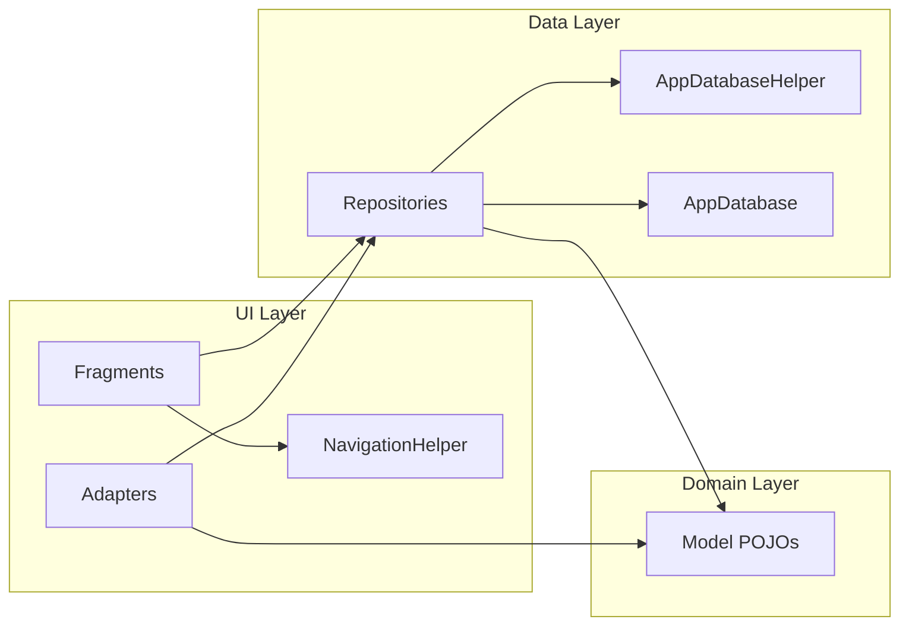

------

## 6.5 Repository-to-Table Mapping Diagram

This diagram documents the intended repository ownership over SQLite tables and the relationships used for list queries.

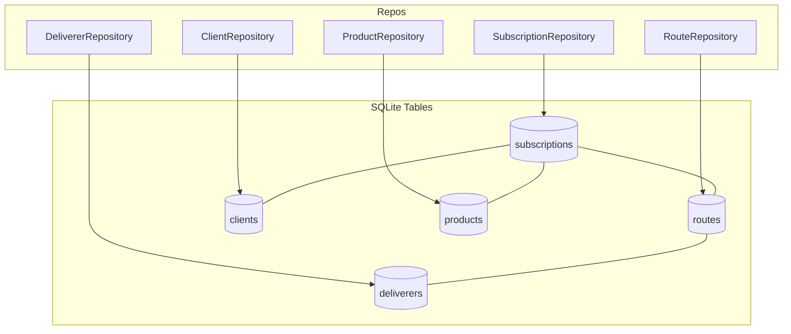

------

## 7. Navigation Structure

### 7.1 High-Level Navigation Flow

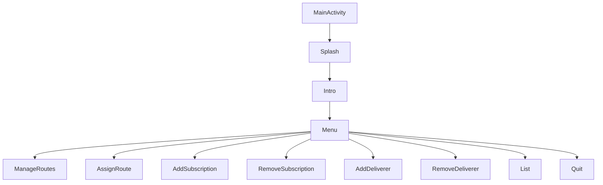

Navigation is centralized through `NavigationHelper`, ensuring:

- No fragment directly manipulates fragment transactions
- Consistent back-stack behavior
- Reduced coupling between UI components

------

## 7.2 Fragment Transaction Sequence (Example: Assign Route)

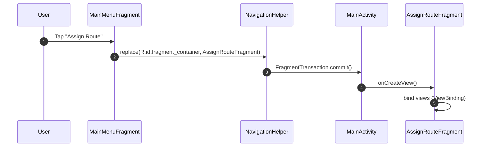

------

## 7.3 List Screen Internal Navigation

The List screen behaves as a controller that swaps the right-side content based on the selected list type.

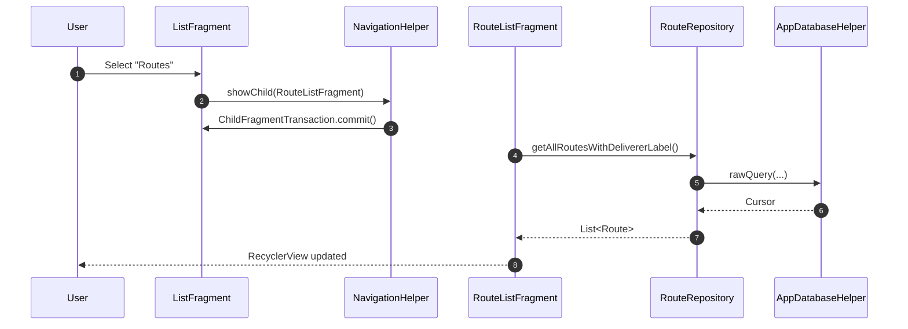

------

## 8. Localization Strategy

- Code identifiers remain in English
- All UI strings are externalized
- Supported locales:
  - Default: English
  - French Canadian: `values-fr-rCA`

------

## 9. UX & UI Compliance

- All screens provide a **Back to menu** action
- RecyclerView is used everywhere except when GridView is explicitly required
- UI layout strictly follows mandate specifications (split screens, panels)
- Form validation and confirmation messages are always visible to the user
- Screenshots confirm visual compliance with the required UX

------

## 9.1 UI–Data Interaction Diagram

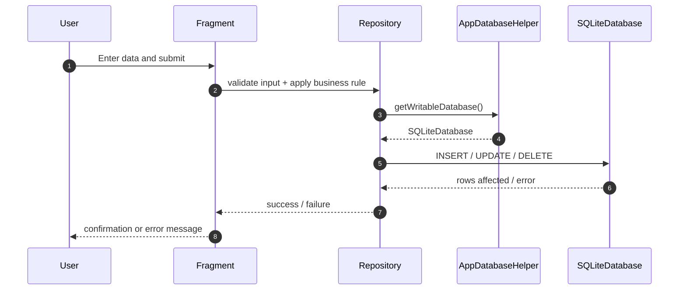

------

## 9.2 UI Layout-to-Fragment Mapping

This diagram documents how XML layouts map to fragments and adapters based on the actual `res/layout` tree.

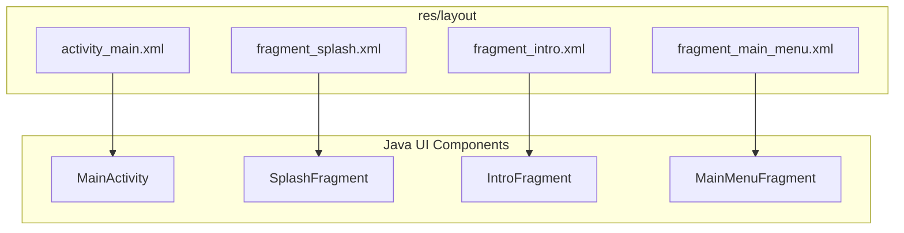

```mermaid
flowchart TB

    subgraph Layouts[res/layout]
        fragment_manage_routes_xml[fragment_manage_routes.xml]
        fragment_manage_top_xml[fragment_manage_route_top_section.xml]
        fragment_manage_bottom_xml[fragment_manage_route_bottom_section.xml]
        fragment_assign_route_xml[fragment_assign_route.xml]

        fragment_add_subscription_xml[fragment_add_subscription.xml]
        fragment_remove_subscription_xml[fragment_remove_subscription.xml]
        dialog_create_client_xml[dialog_create_client.xml]

        fragment_add_deliverer_xml[fragment_add_deliverer.xml]
        fragment_remove_deliverer_xml[fragment_remove_deliverer.xml]

        fragment_list_xml[fragment_list.xml]
        fragment_deliverer_list_xml[fragment_deliverer_list.xml]
        fragment_subscribers_list_xml[fragment_subscribers_list.xml]
        fragment_route_list_xml[fragment_route_list.xml]
        fragment_product_list_xml[fragment_product_list.xml]
    end

    subgraph Screens[Java UI Components]
        ManageRoutesFragment
        ManageRouteFragmentTopSection
        ManageRouteFragmentBottomSection
        AssignRouteFragment

        AddSubscriptionFragment
        RemoveSubscriptionFragment

        AddDelivererFragment
        RemoveDelivererFragment

        ListFragment
        DelivererListFragment
        SubscribersListFragment
        RouteListFragment
        ProductListFragment
    end

    fragment_manage_routes_xml --> ManageRoutesFragment
    fragment_manage_top_xml --> ManageRouteFragmentTopSection
    fragment_manage_bottom_xml --> ManageRouteFragmentBottomSection
    fragment_assign_route_xml --> AssignRouteFragment

    fragment_add_subscription_xml --> AddSubscriptionFragment
    fragment_remove_subscription_xml --> RemoveSubscriptionFragment
    dialog_create_client_xml --> AddSubscriptionFragment

    fragment_add_deliverer_xml --> AddDelivererFragment
    fragment_remove_deliverer_xml --> RemoveDelivererFragment

    fragment_list_xml --> ListFragment
    fragment_deliverer_list_xml --> DelivererListFragment
    fragment_subscribers_list_xml --> SubscribersListFragment
    fragment_route_list_xml --> RouteListFragment
    fragment_product_list_xml --> ProductListFragment

```

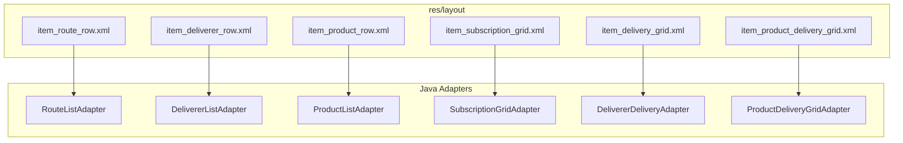

------

## 10. Conclusion

The **Magazine Delivery App** fully satisfies all functional, architectural, and technical requirements defined in the mandate. The application demonstrates:

- Strict compliance with all required features
- A clean, layered, and exam-compliant architecture
- Proper use of fragments within a single-activity design
- Correct SQLite persistence without ORM abstraction
- Clear separation of responsibilities across packages
- Robust handling of business rules and edge cases